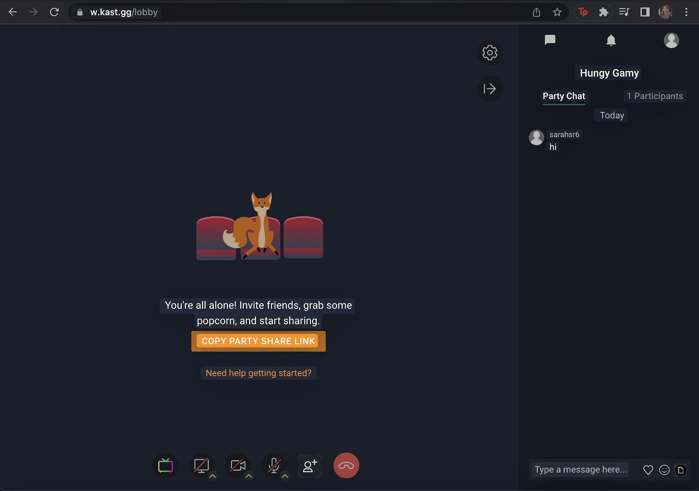
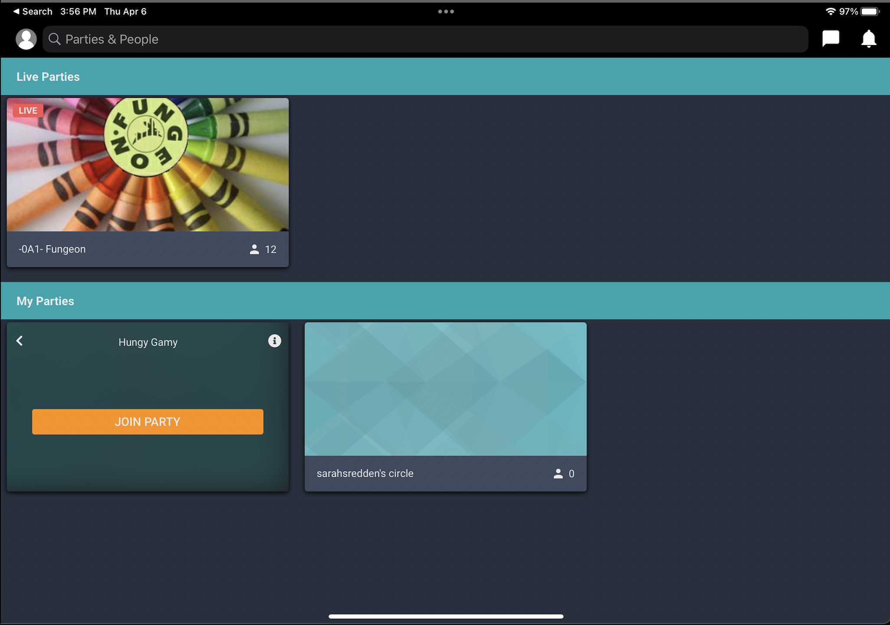
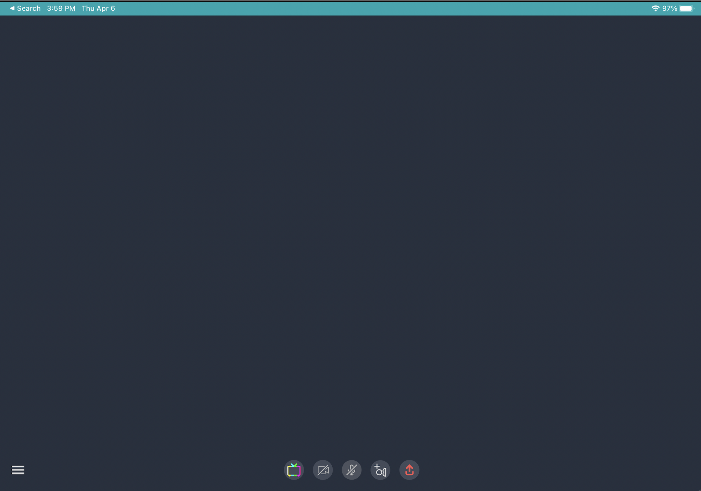

# Connecting via Watchparties
## Heuristic Evaluation
##### Sarah Redden | DH110 User Interface and Design

The COVID-19 pandemic forced people around the world to adjust their daily routines and find new ways of staying connected with family and friends. With strict lockdowns and social distancing measures in place, many turned to the internet and online streaming apps as a means of keeping in touch and sharing experiences.

As the demand for online entertainment surged, various apps and platforms emerged to cater to the specific needs of people looking to share movies and TV shows remotely with loved ones. These apps not only allowed people to watch their favorite movies and TV shows together, but also provided a way for them to chat and socialize in real-time. Since these apps were relativiely new, there were constant updates making it occasionally difficult for users to keep up with. 

Apps such as Kast and Discord, allow people to stream content from various sources, including YouTube and Amazon Prime Video, and interact with their friends in real-time through a chat function. These apps have provided a new way for people to bond over shared interests and engage in virtual movie nights with loved ones, even when separated by distance. These apps are great ideas, but have some limitations in terms of conection. 

The rise of online streaming apps and platforms during the COVID-19 pandemic has not only revolutionized the way people consume entertainment, but also provided a means of staying connected with family and friends. These apps have become a popular way for people to share experiences, enjoy movie nights together, and feel closer despite being physically apart.

We will take an in depth look at spacific apps mentioned above and see if there is any way to make streaming and connecting easier. I will do this using Jakob Nielson's 10 Usability Heuristics as desgribed below:

### Explination of [10 Usability Heuristics](https://www.nngroup.com/articles/ten-usability-heuristics/) 

| Number | Heuristic | Description |
|---|---|---|
| #1 | Visibility of System Status | Users, by design, should be informed about what is going on through feedback |
| #2 | Match Between System and the Real World | The design should use words and phrases familliar to the user and follow real world conventions |
| #3 | User Control and Freedom | Needs to have an undo or exit because users are expected to make mistakes.. users need control |
| #4 | Consistency and Standards | Follows industry conventions so that users dont have to wonder whether different words or actions mean the same thing |
| #5 | Error Prevention | Eliminate all error prone conditions so users dont encounter any errors |
| #6 | Recognition Rather Than Recall | Users shouldnt have to remember informations from one part of the interface to another. Make any needed info visable |
| #7 | Flexibility and Efficiency of Use | Shortcuts for more experienced users are nice to speed up interaction so it caters to novice and experienced users |
| #8 | Aesthetic and Minimalist Design | Should not contain info that is irrelivant or rarely needed as to not diminish relative visibility |
| #9 | Help Users Recognize, Diagnose, and Recover From Errors | Error messages should indicate the problem in plain language and suggest a clear solution |
| #10 | Help and Documentation | System shouldnt need additional explanations, but it may be necessary to help users understand how to compete some tasks |

### Explination of [Severity Ratings](https://www.nngroup.com/articles/how-to-rate-the-severity-of-usability-problems/)  

I will be using the scale below to rate any issues with the apps I evaliate:
| Rating | Description |
|---|---|
| 1 | Cosmetic problem only: need not be fixed unless extra time is available on project |
| 2 | Minor usability problem: fixing this should be given low priority |
| 3 | Major usability problem: important to fix, so should be given high priority |

 
  

## First App: [Kast](https://www.kastapp.co/)

Kast is a social app that allows users to watch movies, TV shows, and live streams together with friends and family. It was previously known as "Rabbit" but rebranded in 2019 as "Kast."

With Kast, users can create virtual "parties" and invite friends to join. Once in a party, users can stream content from popular platforms like Netflix, Amazon Prime Video, or Hulu, or they can share their own screen to watch content from their personal collection.

In addition to watching content, Kast has chat and voice chat features, allowing users to communicate with each other while they watch. This makes it a nice way to stay connected with friends or family members who are far away.

### Evaluation

Kast can be used on the computer or as an app on the phone/tablet. Looking at it on the computer, there are some clear differences in quality, esthetic, and usability. 

| Main Page: | Kast Party: |
| --- | --- |
|  |  |

Looking at the view on the laptop, it is a fairly straightforeward website that is very easy to use. On the main page you can easily create a party then click to join. Once you join, there is a group chat bar on the side that allows you to chat with friends in the party. At the bottom, there are symblols that clearly allow you to either share your screen, turn on your camera/mike, or share link with friends. Overall the website is a simple design that works similar to zoom. 

However, I did encounter many issues when using the app on my phone or tablet. It is advertized to be exactly the same thing, but even by looks it is clearly not. 

| Main Page: | Kast Party: |
| --- | --- |
|  |  |

The app gives users much less control. You cant share your screen, or create your own parties. Even when you join a party, there are many errors because it doesnt work more than half of the time. Because the app is less developed, I will focus on the website during the evaluation and add only some commentairy on the app.

### Heuristic Evaluation

| *Heuristic* | *Evaluation* | *Recommendation* | *Rating* |
| --------- | ---------- | -------------- | ------ |
| 1. Visibility of System Status | The website shows you who is in a room before you enter a party, which is very nice. Once you get in that room, it feels empty because there is no representation of who is actually in there. Other than that, the website is pretty clear about what sate everything is in like connecton, messages and streaming. | I think they should implement bubbles or boxes that represent the people in the room so you can see who is there even if their camera is turned off. This is important users can tell who is watching and who logged off. | 2 |
| 2. Match Between System and the Real World | Kast does a good job in using real world conventions to make the website more intuative to users. It uses basic symbols at the bottom which most people know already to indicate actions. There is a share your screen, turn on camera, mic, share link, and end party buttor. Even the flow of making a party group is very intuitive. You click the plus button, create a name, join then share the link. the only thing I would say is that the app for the pone and tablet doesnt include most of these elements. There is no intuitive way to see the message box or to create a group. | They should take the elements of the website and implement them onto the app. It would make much more sense if both were similar layouts and had similar actions. | 3 |
| 3. User Control and Freedom | When you are inside the party and make a mistake, it is prety easy to fix that mistake. If I send a message I dont like, I can delete it. If I start to share my screen, there are options to cancel or I can end it if I started it. However, if I make a party group, that group name seems to stay there forever, or I havent found a way to delete groups yet. This can be problematic if I make many parties it can get overwhelming. | There should be an option to delete parties on your home page. | 1 |
| 4. Consistancy and Standards | The website does a good job of followig standard procedures commonly known to users. I would say this has a very similar layout to zoom, which alot of people have grown acostomed to through covid. They also use the same symbols which makes every button intuative. The only difference is that the menu symble on the app doesnt take you to a typical or even useful menu. It just shows you viewers, which isnt what you would expect. | The button that currently shows the viewers is a 3 lined button which typically indicates "menu" on other apps. They need to switch the symble to be a person or something more intuitive. | 1 |
| 5. Error Prevention | This website is unfortunately prone to many errors. Companies like Netflix, Hulu, Disney and more have worked hard to try to prevent people from streaming their shows, because people can stream their accounts to others who dont have accounts. Thats why when people try to stream sometimes, the screen is black, or the sound doesnt go through. There are ways to get around these errors though, but the website doesnt even register that something is wrong. Another issue that happens alot is that some people have trouble joining parties alot of the time. The website doent notify the host, and also doesnt attempt to help the person having the issue. This can get hard sometimes for users to even figure out. | The website needs to identify when an error is occuring and prompt the user on ways to fix it. It should register when the stream isnt showing, or when someone disconnects, then notify the entire party. | 3 |
| 6. Recognition Rather than Recall | Kast tells you who is in the party when you join, but expects you to remenber once you are actually inside the call. This is not helpful when you are trying to invite other members or even wait for everyone before starting a show. | They need to have an active display of viewers at all times so the information is availible at all times. | 2 |
| 7. Flexibility and Efficiency of Use | If you are a first time user, you will have to go through the steps of making an account, logging in, creating a party, inviting friends ...ect. But once you did that, you have a shortcut the next time you want to watch with friends because the party group you made saved. All everyone has to do is join the same group again so it is a bit faster. The website itself isnt too complecated, so there isnt too much you would need to speed up. | Make app for phone and tablet work so that users dont have to waste time fixing error after error. Other than that, the website is pretty good in this sense. | 1 |
| 8. Aesthetic and Minimalistic Design | When you want to make a new party, there are alot of options that pop up that seem maybe unnecesary. You have to choose a group name, description, tags, and a privacy policy. You also have to choose a name that isnt already taken by someone, which is pretty difficult. At the same time, the app for the phone and tablet is way too simple where it doesnt even work. | I would suggest attaching a link to the group instead of having us sift through ID's that may or may not work. I also think a description and tags are not needed at all. | 1 |
| 9. Help Users Recognise, Diagnose, and Recover from Errors | Kast has many issues when it comes to errors. For one, if there is an error kast will jusy have a blank screen. There are no messages or suggestions on what to do. There aren't even buttons to click sometimes. The only thing users can to is close the brouser and re open the site. This is very similar to what the app does for the phone and tablet. The app is so simple and doesnt even seem like it is fully developed. | There needs to be error messages and prompt suggestions for when errors arrise. Most the time the user isnt sure if it is their wifi or the website itself. | 3 |
| 10. Help and Documentation | With all the issues kast has, there is also no documentation at all for support. There are some blogs, but they are not useful at all. | Even if there were minimal issues with Kast itself, the company should still provide documentation for help because they are using this to connect to many other sites, which can be tricky for users. | 3 |

## Second App: [Discord](https://discord.com/)

### Evaluation

### Heuristic Evaluation

| *Heuristic* | *Evaluation* | *Recommendation* | *Rating* |
| --------- | ---------- | -------------- | ------ |
| 1. Visibility of System Status | Visability isnt discord's strongsuit because there is hust alot going on it is hard to see actionalble buttond. For one, when one enters a call, ending it can be hard because the button is so small and hard to find, then you have to click it twice in some cases. Then when you are on a call on the phone app, it is very difficult to see the chat or even get notifications. Finally, joining call servers are also similar because the buttons all look so similar. | I think to solve this problem they need to make the display mor simple or at least a little more intuative for new users. Discord has alot going on, so the buttons need to make sense, so they also need to use more common symbols. | 2 |
| 2. Match Between System and the Real World | Discord is not similar to any other app, so it is hard for users to learn. There are alot of helpful pop ups which use very natural landuage. Discord acts as a helper bot and says things like "oops we are having an issue". This is very heplful but sometimes isnt enough. The buttons arent intuitive and takes a learning curve. | The natural languige already implemented is nice and makes the app less intimidating. Maybe they can use that natural language to give more help. | 1 |
| 3. User Control and Freedom | User control on discord is very nice, but only if you know what you are doing. For new users, the exits arent very obvious compared to typical apps. Mistakes are very much more prone because new users click things and they do unexpected results. From there it is hard to know what happened and the exit to the event is also so small. There is also no redo or undo buttons with discord. However when you send a message, you are actually able to edit the message or delete, which is very nice, but again that options isnt very clear unless you are experienced. | One thing they can do is make the exit buttons bigger. This helps tell users they are in an active event while also showing them a clear path to leave. This would help newer users learn quicker. | 3 |
| 4. Consistancy and Standards |  Typically we have conventional symbol;s for certain functions. A phone means to call, a red phone meand hangup, a text bubble means message... ect. However, discord made up their own symbols for everything, which makes actions very unintuitive. A pound means chat, while a speaker means call. Then they use their own discord logo as a button to directly message someone. This makes it immensly harder for new users to learn and make them want to find another app. | I think they definately need to replace their buttons with standard ones. They have a good layout and this would be a simple fix, which would attract new users, while not changing much on current users. | 3 |
| 5. Error Prevention | There are some errors when it comes to discord, but they do a good job of mitigating any in the first place. One error that allways occurs for me is wifi when connecting to a voice channel. DIscord requires a strong connection, which is more than UCLA can handle on my mac. The app does a good job of telling you the exact issue though and also sends messages to help in some cases. Other than that, there aren't many errors with the app itself. It is made to work with other apps, stream, call, so they made it pretty robust which shows. | One thing they can do is send an error message giving ideas how to troubleshoot. The app tells me it isnt connected, but doent tell me ehat I need to do to fix it. | 2 |
| 6. Recognition Rather than Recall |  |  |  |
| 7. Flexibility and Efficiency of Use |  |  |  |
| 8. Aesthetic and Minimalistic Design |  |  |  |
| 9. Help Users Recognise, Diagnose, and Recover from Errors |  |  |  |
| 10. Help and Documentation |  |  |  |
