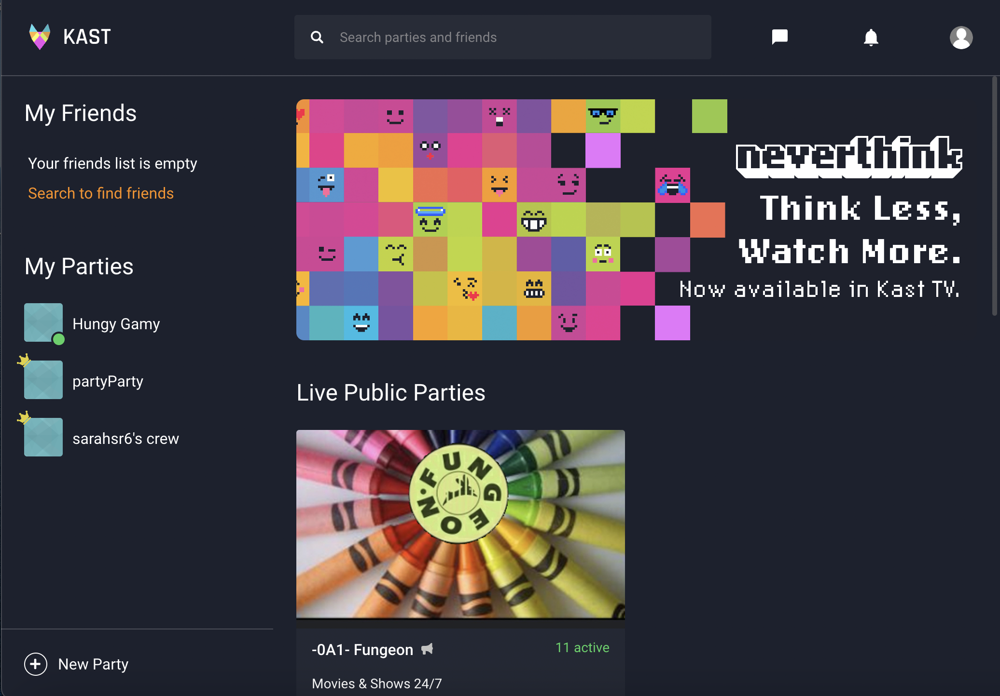

# Connecting via Watchparties
## Heuristic Evaluation
##### Sarah Redden | DH110 User Interface and Design

The COVID-19 pandemic forced people around the world to adjust their daily routines and find new ways of staying connected with family and friends. With strict lockdowns and social distancing measures in place, many turned to the internet and online streaming apps as a means of keeping in touch and sharing experiences.

As the demand for online entertainment surged, various apps and platforms emerged to cater to the specific needs of people looking to share movies and TV shows remotely with loved ones. These apps not only allowed people to watch their favorite movies and TV shows together, but also provided a way for them to chat and socialize in real-time. Since these apps were relativiely new, there were constant updates making it occasionally difficult for users to keep up with. 

Apps such as Kast and Discord, allow people to stream content from various sources, including YouTube and Amazon Prime Video, and interact with their friends in real-time through a chat function. These apps have provided a new way for people to bond over shared interests and engage in virtual movie nights with loved ones, even when separated by distance. These apps are great ideas, but have some limitations in terms of conection. 

The rise of online streaming apps and platforms during the COVID-19 pandemic has not only revolutionized the way people consume entertainment, but also provided a means of staying connected with family and friends. These apps have become a popular way for people to share experiences, enjoy movie nights together, and feel closer despite being physically apart.

We will take an in depth look at spacific apps mentioned above and see if there is any way to make streaming and connecting easier. I will do this using Jakob Nielson's 10 Usability Heuristics as desgribed below:

### Explination of [10 Usability Heuristics](https://www.nngroup.com/articles/ten-usability-heuristics/) 

| Number | Heuristic | Description |
|---|---|---|
| #1 | Visibility of System Status | Users, by design, should be informed about what is going on through feedback |
| #2 | Match Between System and the Real World | The design should use words and phrases familliar to the user and follow real world conventions |
| #3 | User Control and Freedom | Needs to have an undo or exit because users are expected to make mistakes.. users need control |
| #4 | Consistency and Standards | Follows industry conventions so that users dont have to wonder whether different words or actions mean the same thing |
| #5 | Error Prevention | Eliminate all error prone conditions so users dont encounter any errors |
| #6 | Recognition Rather Than Recall | Users shouldnt have to remember informations from one part of the interface to another. Make any needed info visable |
| #7 | Flexibility and Efficiency of Use | Shortcuts for more experienced users are nice to speed up interaction so it caters to novice and experienced users |
| #8 | Aesthetic and Minimalist Design | Should not contain info that is irrelivant or rarely needed as to not diminish relative visibility |
| #9 | Help Users Recognize, Diagnose, and Recover From Errors | Error messages should indicate the problem in plain language and suggest a clear solution |
| #10 | Help and Documentation | System shouldnt need additional explanations, but it may be necessary to help users understand how to compete some tasks |

### Explination of [Severity Ratings](https://www.nngroup.com/articles/how-to-rate-the-severity-of-usability-problems/)  

I will be using the scale below to rate any issues with the apps I evaliate:
| Rating | Description |
|---|---|
| 1 | Cosmetic problem only: need not be fixed unless extra time is available on project |
| 2 | Minor usability problem: fixing this should be given low priority |
| 3 | Major usability problem: important to fix, so should be given high priority |

 
  

## First App: [Kast](https://www.kastapp.co/)

Kast is a social app that allows users to watch movies, TV shows, and live streams together with friends and family. It was previously known as "Rabbit" but rebranded in 2019 as "Kast."

With Kast, users can create virtual "parties" and invite friends to join. Once in a party, users can stream content from popular platforms like Netflix, Amazon Prime Video, or Hulu, or they can share their own screen to watch content from their personal collection.

In addition to watching content, Kast has chat and voice chat features, allowing users to communicate with each other while they watch. This makes it a nice way to stay connected with friends or family members who are far away.

### Evaluation

Kast can be used on the computer or as an app on the phone/tablet. Looking at it on the computer, there are some clear differences in quality, esthetic, and usability. 

| Main Page: | Kast Party: |
| --- | --- |
|  |  |

Looking at the view on the laptop, it is a fairly straightforeward website that is very easy to use. On the main page you can easily create a party then click to join. Once you join, there is a group chat bar on the side that allows you to chat with friends in the party. At the bottom, there are symblols that clearly allow you to either share your screen, turn on your camera/mike, or share link with friends. Overall the website is a simple design that works similar to zoom. 

However, I did encounter many issues when using the app on my phone or tablet. It is advertized to be exactly the same thing, but even by looks it is clearly not. 

| Main Page: | Kast Party: |
| --- | --- |
|  |  |

The app gives users much less control. You cant share your screen, or create your own parties. Even when you join a party, there are many errors because it doesnt work more than half of the time. Because the app is less developed, I will focus on the website during the evaluation and add only some commentairy on the app.

### Heuristic Evaluation

| *Heuristic* | *Evaluation* | *Recommendation* | *Rating* |
| --------- | ---------- | -------------- | ------ |
| 1. Visibility of System Status | 
The website chooses  | more info | 2 |

## Second App: [Discord](https://discord.com/)

### Evaluation

### Heuristic Evaluation

