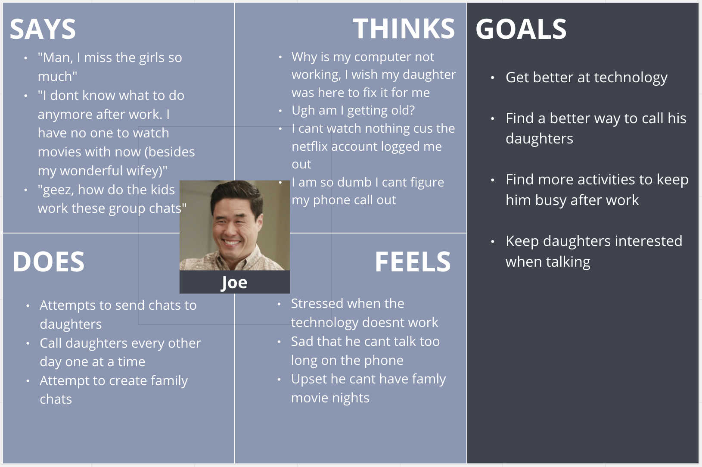
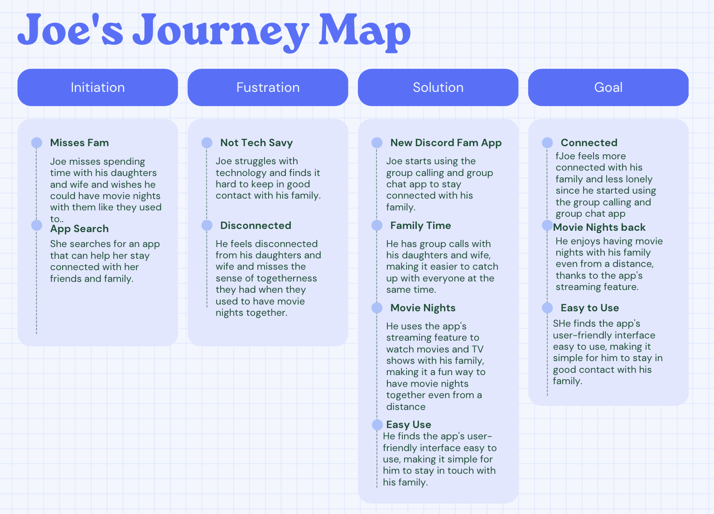

# UX Storytelling: Persona + Scenareo
DH110 User Experience and Design

Assignment 4

## 📖 The Purpose of UX Storytelling 📖
User Experience (UX) storytelling is a technique used in designing and creating digital products and services that aim to engage users by appealing to their emotions, needs, and desires. It is the art of crafting a narrative that connects users with a product or service, and it is a crucial part of UX design.
The purpose of UX storytelling is to create a user-centered design approach that prioritizes empathy and understanding of the user's needs, preferences, and behaviors. This approach allows designers to create more engaging and meaningful experiences that connect with users on a deeper level, which ultimately leads to higher user satisfaction, loyalty, and retention. In this way, UX storytelling is an essential tool for designers seeking to create digital products and services that are both functional and emotionally impactful.

## ✅ Tasks: Improved Discord for Famlies ✅
1. Have an easy-to-use group chat and group call with friends and loved ones
2. Easily share a movie virtually, while being able to voice call and chat simultaniously

I want to make an app that is easy for people of all ages to complete. Lets take a look at some personas, and see if this app can help with some of their struggles.

## 👤 Persona Creation and Empathy Maps 👤

### Persona #1: Daniella Johnson, Biology Transfer Student at Arizna State

##### Daniella's Empathy Map

### Persona #2: Joe Smith, Dad of 2 girls, Finance worker in New Jersey

##### Joe's's Empathy Map

## 🗺 Scenareos and Journey Map 🗺

### Scenario #1: Daniella

##### Why
Daniella is feeling overwhelmed with the workload of college and trying to maintain individual relationships with each of her friends. She misses the close-knit social circle she had back home and feels disconnected from her friends and family. She finds it hard to juggle all her responsibilities and maintain a healthy social life.

##### How
By using the group calling and group chat app, Daniella can save time and energy while staying connected with her friends. She can have group calls with all her friends at once, making it easier to catch up with everyone at the same time. Additionally, she can use the group chat to share updates, memes, and jokes with all her friends, creating a sense of camaraderie and closeness even from a distance. She can also use the app's streaming feature to watch movies and TV shows with her friends, making it a fun way to multitask her relaxation time with catching up with her friends.

##### Daniella's Journey Map
 

### Scenario #2: Joe

##### Why
Joe is feeling lonely and disconnected from his family since his youngest daughter moved away for college. He misses spending time with his daughters and wife and wishes he could have movie nights with them like they used to. However, he struggles with technology and finds it hard to keep in good contact with his family.

##### How
By using the simple and user-friendly group calling and group chat app, Joe can easily stay connected with his family and have movie nights with them even from a distance. The app's streaming feature makes it easy for him to watch movies with his family, and its user-friendly interface makes it simple for him to use.

##### Joe's Journey Map

