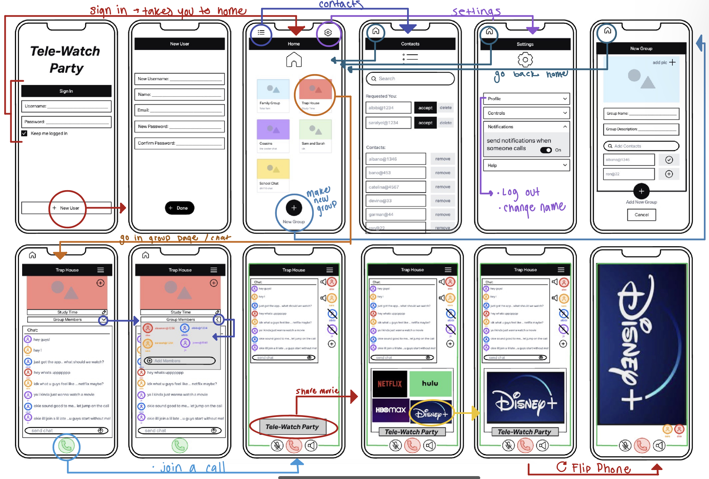
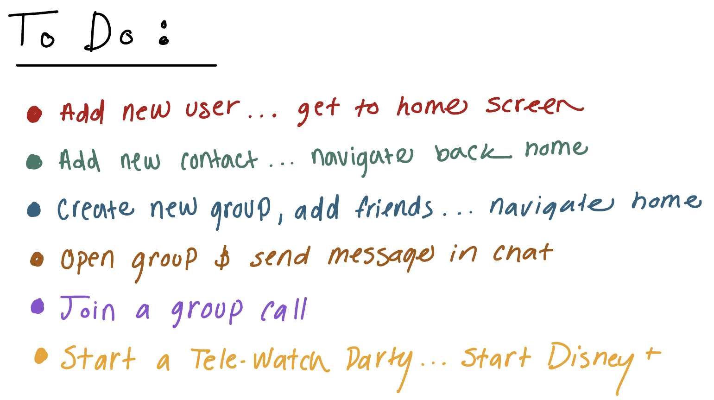
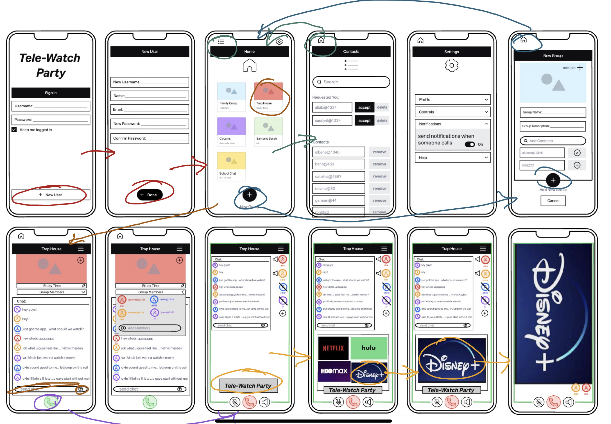

# Assignment #6: Low Fidelity Prototype

Sarah Redden
DH110: User Experience and Design

## Project Description

For my project I developed an app called Tele-Watch Party. It is a social app designed to help people of all ages stay connected with their friends and family. With this app, users can create groups, chat, and join group calls, making it easy to catch up with loved ones from anywhere in the world. One of the standout features of Tele-Watch Party is its Tele-Watch button, which allows users to share movies or shows from popular streaming services such as Netflix, Hulu, Disney+, or HBO Max. This means that users can watch their favorite shows together in real-time, no matter where they are located. They can also do this while on a call, which isnt popular in any apps currently.

Recently, I conducted some user research on some similar competitor apps currently availible. After various testing I found that there are some major problems that make it very difficult for users to share shows:

* Some apps like discord are more complecated, which turns users awat from even trying.
* Ohter apps like zoom don't provide steps to get arould the blocking features streaming apps have to prevent users from sharing their screen 
* Apps made specifically for sharing movies don't allow for calls at the same time. They just include a chat message feature

I wanted to take these problems into consideration when designing this new app geared specifically for media sharing. I wanted to make it simple, and as intuitive as possible. In order to do that, I still have some further testing to do alongside developement.

Creating a low fidelity prototype is an important step in the app development process. It allows you to quickly test and validate your ideas before investing too much time or money in the development process. By creating a low fidelity prototype, you can get user feedback early on and make changes as needed, without wasting resources.

A low fidelity prototype like the wireframe I created for Tele-Watch Party is an excellent way to get user input. It allows me to show your idea to potential users and gather feedback on the concept, features, and overall usability of the app. This feedback can then be used to improve the app and create a better user experience.

For this project, I created a wireframe and wireflow, which I then tested with some users in order to get some feedback for futher developement. Creating a low fidelity prototype is an essential step in the app development process, as it allows me to test my ideas and gather feedback from potential users.

## Tasks

1. Add a new user account and sign in
2. Add some new contacts, and navigate back home
3. Create a new group and add some friends to it
4. Send a message in a group's chat 
5. Join a group call
6. Start a Tele-Watch Party, and watch something on disney plus 

## Wireframe and Wireflow

Wireframe: [Click Here](https://sarah398878.invisionapp.com/freehand/Proj-5-pObe8fZlr)

Wireflow:

## User Interactions
Video Test of Wireframe Tasks: [Click Here](https://www.youtube.com/watch?v=HoBH7-qXdQk)

User Tasks:

User Flow Test: 

## Reflection

The wireflow process helped me to create a low fidelity prototype of my app or website. This prototype helped me nail down basic sketches or wireframes of the app's user interface, along with a flowchart that maps out how users will navigate through the app's various features and functions.

One of the main benefits of the wireflow process is that it allowed me to quickly test and validate my ideas. By creating a low fidelity prototype early on, I was able to identify potential problems and make changes before investing too much time or resources in the development process.

Before I was able to just identify problems with current apps, but this helped me solidify a direction with a new app. Drawing it out allowed me to implement features I saw some current apps lacked.

Then I was able to take my ideas and do a rough test with a user. From this test I found some potential problems with my design, which I may consider in my next round of developement:
* Some buttons weren't as clear as I thought they would be.
> The contacts button was a little hard to find, so I think I might add some text saying it is the contacts as well. 
* Not every pull down menu was completely though throuch, so it could be confusing at times for the user.
> I need to go through the settings page and develope what each pull down tab might include. I think there needs to be more options to edit a profile and different features in the app
* I need to make the setup process a little easier or more clear.
> It seemed a little confusing how to get to the home screen from the log in page. I need to develope that option a little more, or make the button to log in/ sign in bigger
* The settings tab was a little confusing to the user as well.
> The user was just confused why we didnt test the settings page, but that is because I just need a little more developement.

Overall, I found that the wireflow process is a valuable tool for app development. It enables designers and developers to create a clear vision of the app's user interface and user experience, and to gather feedback from users before moving on to more advanced stages of development.

