# Assignment #6: Interface Design

DH 110: User Experience and Design

Sarah Redden

## Introduction
For my project I developed an app called Tele-Watch Party. It is a social app designed to help people of all ages stay connected with their friends and family. With this app, users can create groups, chat, and join group calls, making it easy to catch up with loved ones from anywhere in the world. In those groups, this app makes it easy to share movies with friends while in a group call. 

Last week I designed an overall layout of how the app works and gave a rough wireframe example to show how the flow works which can be seen [here](https://sarah398878.invisionapp.com/freehand/Proj-5-pObe8fZlr) or in assignment 5. Today, I will be going more in depth with the interface design by focusing on a single wireframe, and designing the actual look of the app. I decided to work with the home screen since that is the beginning of the app and gives a feel for its entirety. 

Interface design is important because it is a main factor contributing to user-friendlyness. The goal is to turn our low fidelity designs into a digitized design with a more developed style. This is achieved through color palletes, shape variations, and typographic variations. The dimentions of the frame for the app was done so using an iphone 14 screen size in an online design program called Figma. I will continue to work with Figma to create more detailed wireframes, but for now I will get into some design choices I've had to make so far. Figma will allow me to easily keep all the design choices availible for me to make more frames in the future.

Here is the home scteen page I have ended up with:
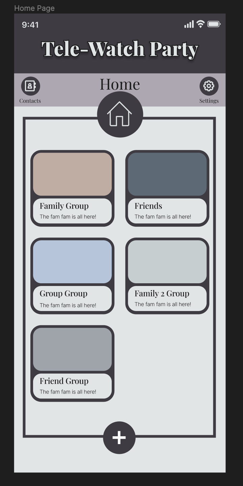

Here is the link to the Figma page: [Click Here](https://www.figma.com/file/XpgB9ePVOq22yYLQFRPqBN/Assignment-6-wireframe?type=design&node-id=0%3A1&t=cx0EaW5fx9dJsCzf-1)

## Screen Design

### Typographic Variations

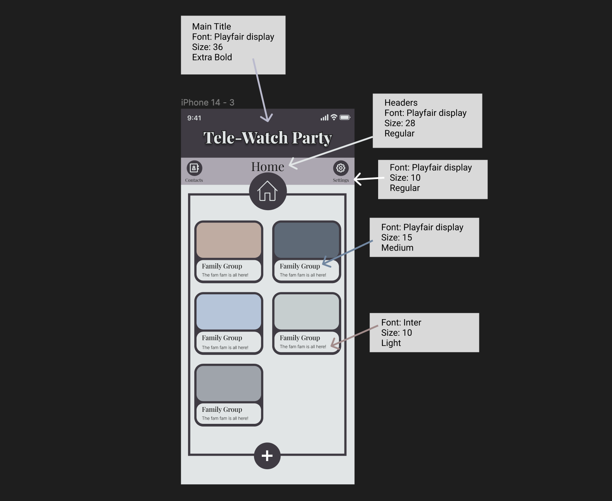

### Shape Variations

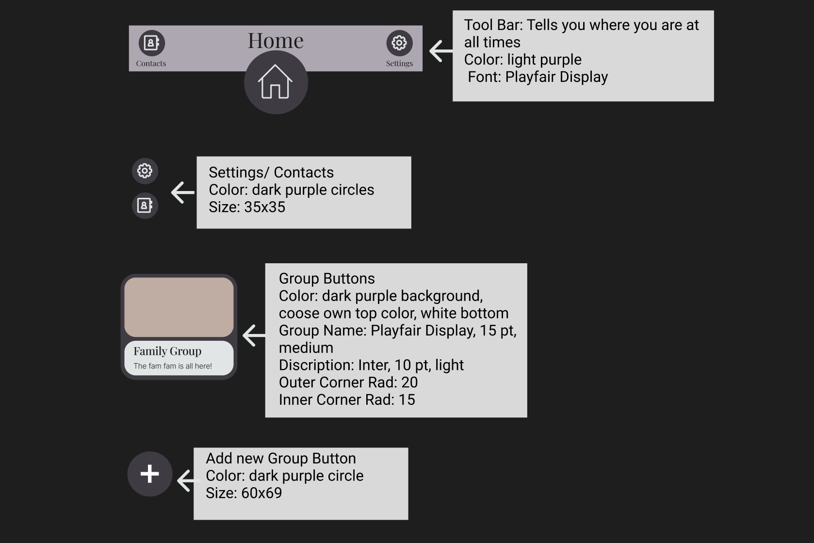

### Color Schemes

#### Color Palette
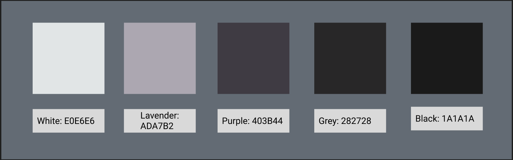

#### Light and Dark Modes
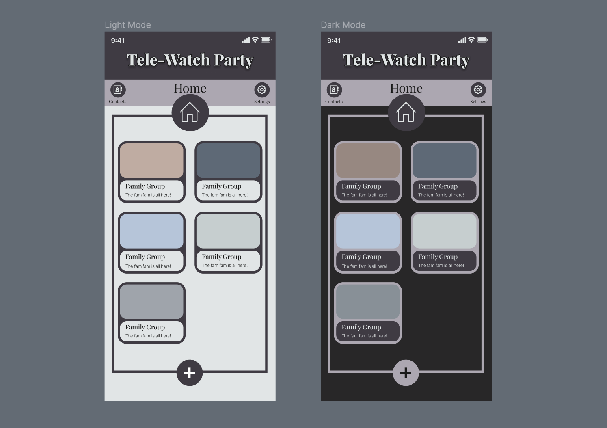

### Layout Test

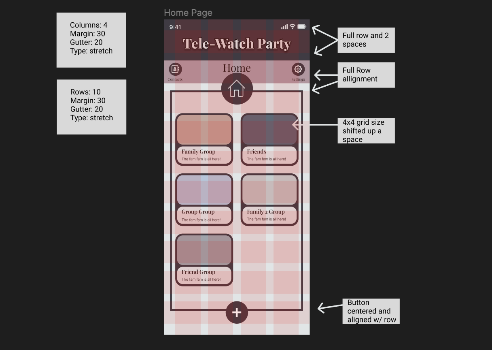

## Accessibility Check (Color-Contrast)

### Title Bars
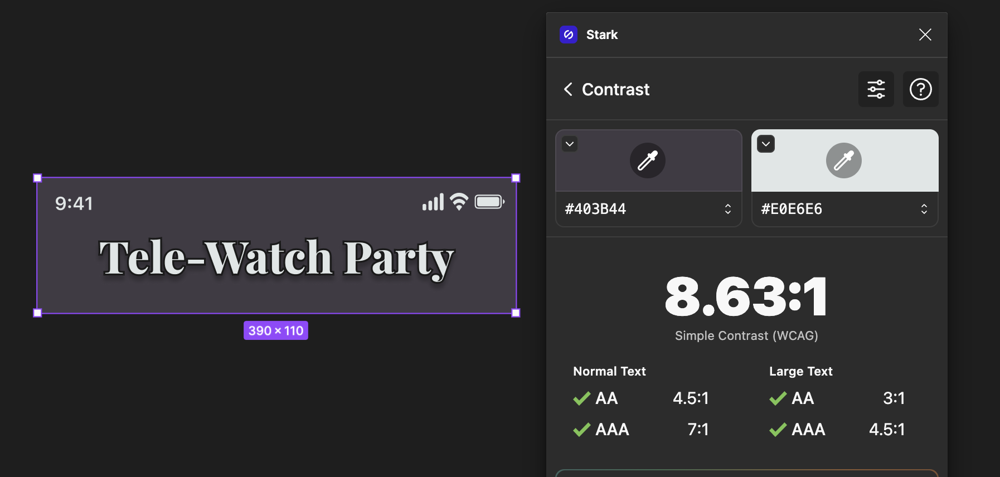
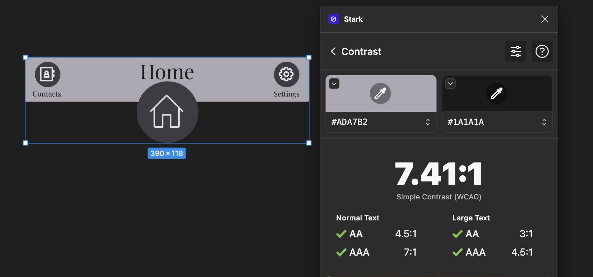
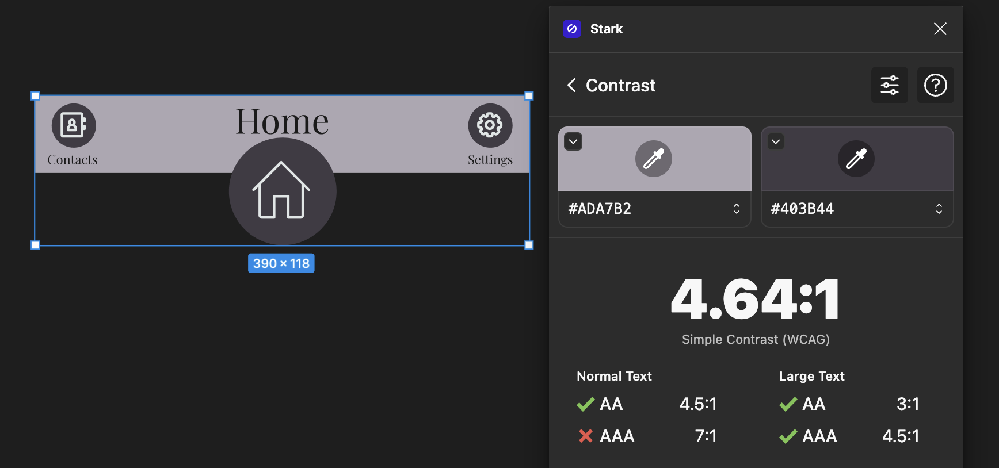

### Light Mode
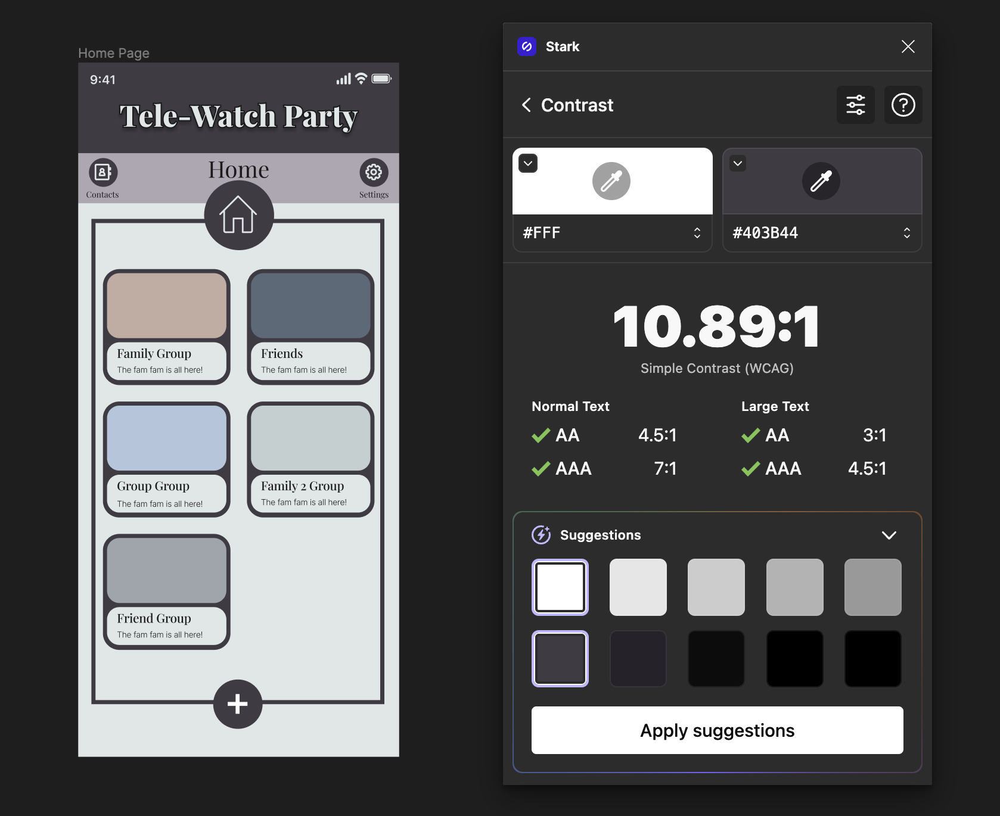

### Dark Mode
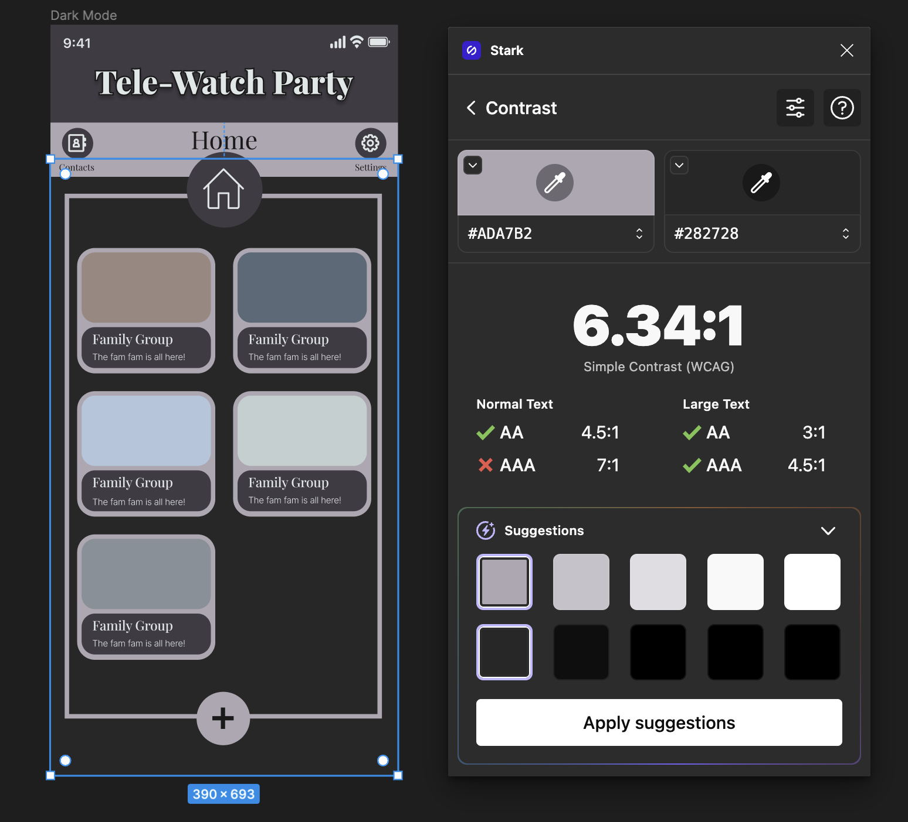

## Impression Test

## Design System Summary

Color Pallete:

White: E0E6E6
Black: 1A1A1A
Dark Purple: 403B44
Light Purple: ADA7B2
Dark Grey: 282728
