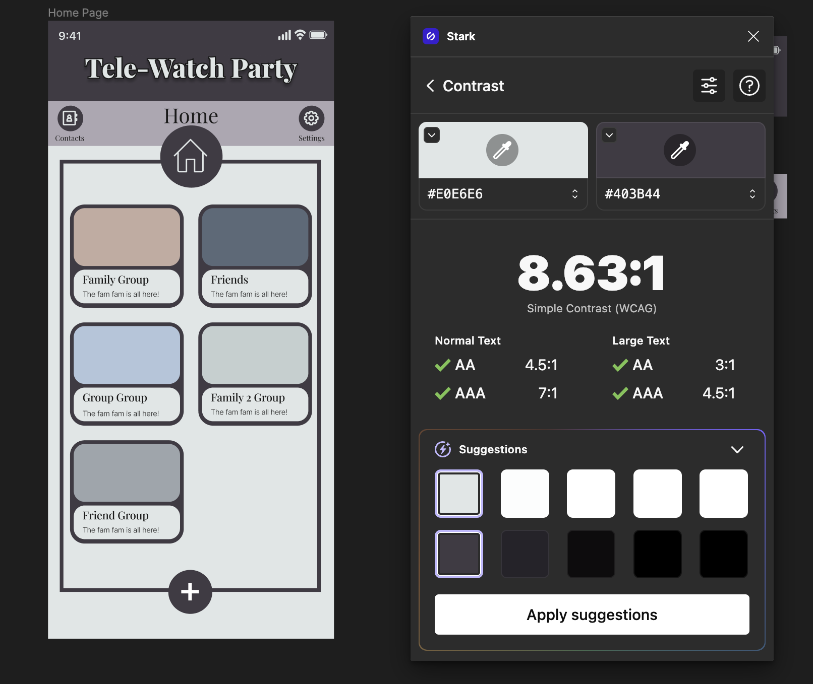

# Assignment #6: Interface Design

DH 110: User Experience and Design

Sarah Redden

## Introduction
For my project I developed an app called Tele-Watch Party. It is a social app designed to help people of all ages stay connected with their friends and family. With this app, users can create groups, chat, and join group calls, making it easy to catch up with loved ones from anywhere in the world. In those groups, this app makes it easy to share movies with friends while in a group call. 

Last week I designed an overall layout of how the app works and gave a rough wireframe example to show how the flow works which can be seen [here](https://sarah398878.invisionapp.com/freehand/Proj-5-pObe8fZlr) or in assignment 5. Today, I will be going more in depth with the interface design by focusing on a single wireframe, and designing the actual look of the app. I decided to work with the home screen since that is the beginning of the app and gives a feel for its entirety. 

Interface design is important because it is a main factor contributing to user-friendlyness. The goal is to turn our low fidelity designs into a digitized design with a more developed style. This is achieved through color palletes, shape variations, and typographic variations. The dimentions of the frame for the app was done so using an iphone 14 screen size in an online design program called Figma. I will continue to work with Figma to create more detailed wireframes, but for now I will get into some design choices I've had to make so far. Figma will allow me to easily keep all the design choices availible for me to make more frames in the future.

Here is the home scteen page I have ended up with:

Here is the link to the Figma page: [Click Here](https://www.figma.com/file/XpgB9ePVOq22yYLQFRPqBN/Assignment-6-wireframe?type=design&node-id=0%3A1&t=cx0EaW5fx9dJsCzf-1)

## Screen Design

### Typographic Variations

### Shape Variations

### Color Schemes

#### Color Palette

#### Light and Dark Modes

### Layout Test

## Accessibility Check (Color-Contrast)

### Title Bars

### Light Mode

### Dark Mode

## Impression Test

## Design System Summary

### Typeface family and size
* Header: "Playfair Display", size 34 pt, extra bold font, letter spacing 5%, black stroke outline, drop shadow effect
> I wanted the header to pop and be larger than most other font so users know what app they are in, which has a distinct design and font. 
* Tool Bar: "Playfair Display", size 28 pt (current screen), size 10 pt (button options), regular font, letter spacing 0%
* Grpup Name: "Playfair Display", size 15 pt, regular font, letter spacing 0%
> I wanted these options to be visable to user so they know where they are at and what buttons are availible. I used Playfair display as the standard font throughout the app.
* Group Description: "Inter", size 10 pt, light font, letter spacing 0%
> I chose "inter" for the descriptions because it was a much lighter font, and I wanted a big contrast between the group title and the discription. 

### Color scheme
* background color light mode (creamy white): E0E6E6
* background color dark mode (dark grey): 282728
* text color (black): 1A1A1A

Accent colors
* Dark Purple (for buttons and title bar): 403B44
* Lavender (for accent background and bitton): ADA7B2

> How I made the decision: I first designed the app in black and white, which gave me the freedom to go with a ain color this week. I wanted to choose a base color that wasn't already taken by any streaming service, since I will be displaying their logos later on. That left few colors to choose from so I went with purple because it is a good color on the eyes and has alot to play around with. I started by picking my favorite dark purple color for the title bar, then used the color contrast testor to help me choose a good shade of contrasting lavender. These colors have similar hues, so I just went for a AA rating because only white woulf fully contrast. From there, i chose a good shade of cremy white and black that contrasts just enough with these 2 colors to go on top of each for letters or background. Then when I got to dark mode, I used a similar technique to choose the dark grey background. I really like how my color scheme goes together ehile sticking to a simple theme.

How I made the decision: For the color scheme, I wanted to use Hawaii's Division of State Parks website as inspiration, as well as the images of Hawaii displayed on their front page. The colors I chose (sand and blue) were very nature and beach themed, which is inspired by what Hawaii is best known for. The brown and green was also inspired by the branding used on Hawaii's Division of State Parks website, so overall, I am happy with the final color scheme. My interviewee also noticed how the colors reminded them of the beach and palm trees, which was my intention with these colors.

Layout grid and spacing
for the layout grid, I used a 10 pixel grid, where the distance between each grid space represented 10 pixels.
How I made the decision: I chose to use a grid because I was familiar with grids from my past graphic design experiences and found them easier to use and organize spacing based on my personal experiences. I also used 3 grid spaces (aka 30 pixels) a lot for the design elements and spacing. For example, the drop down menu's height was 3 grid spaces, the gutter was 3 grid spaces, and the distance between each state park component was 3 grid spaces as well. This was done to provide more consistency within the design when it came to spacing.

Color Pallete:

White: E0E6E6
Black: 1A1A1A
Dark Purple: 403B44
Light Purple: ADA7B2
Dark Grey: 282728
