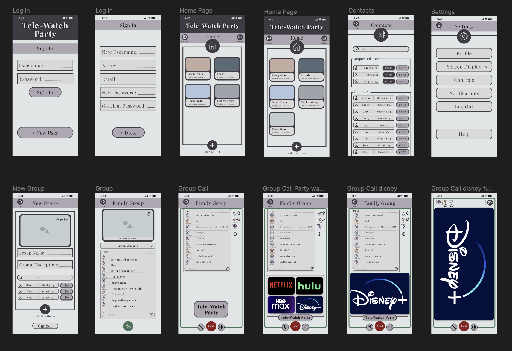
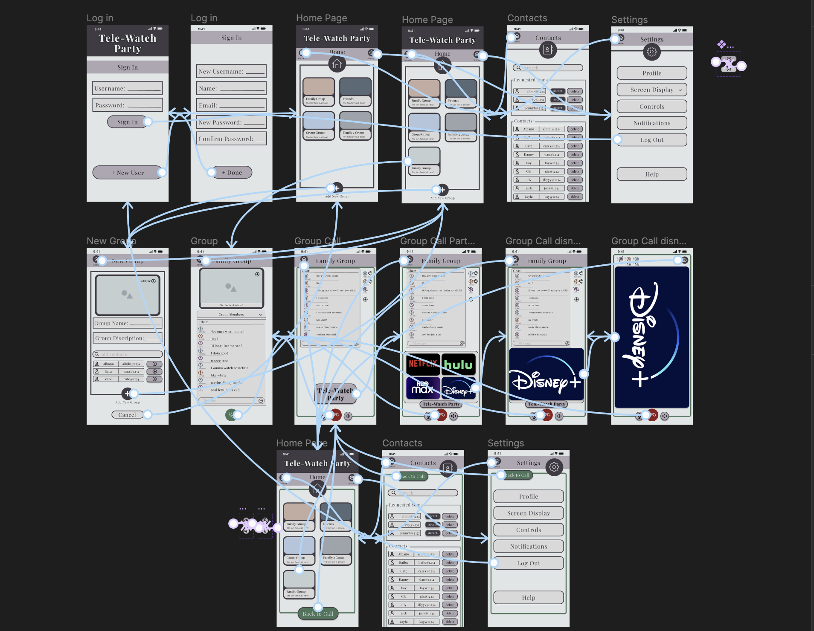
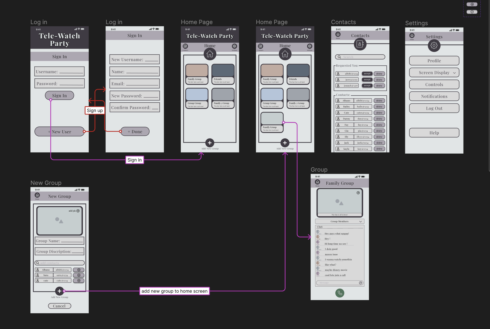
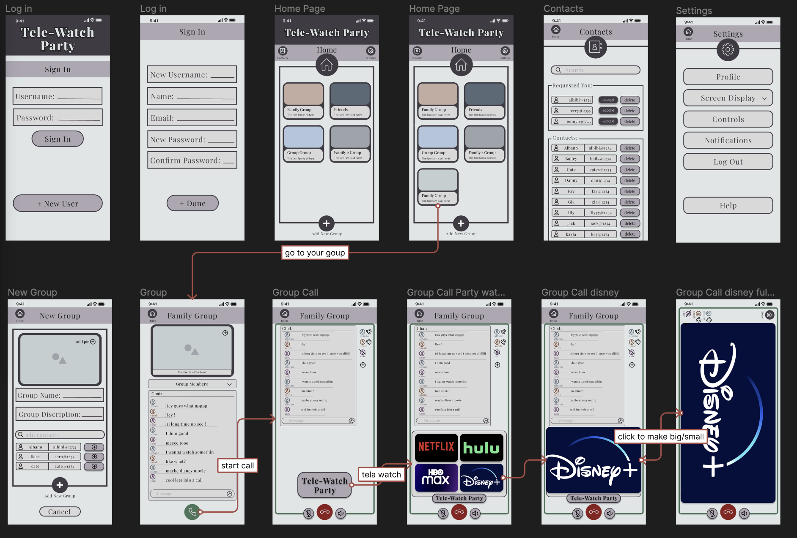
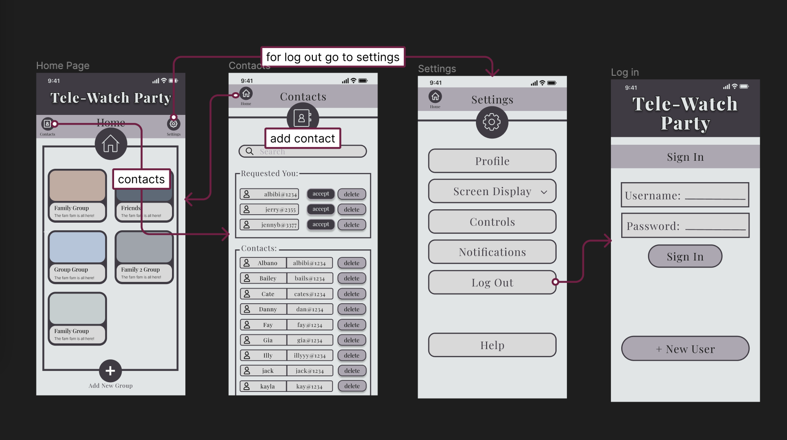

# High Fidelity Prototype: Tele-Watch Party
Assignment #7 DH110: User Experience and Design

Sarah Redden

## Intro of Project Description

I wanted to design an app for users of all age to beable to stay in touch and share movies and shows from far away. Most apps that allow you to do this are very complecated, so I wanted to design something easy to use. I designed an app called tele-watch party. It allows users to create groups where they can message, call, and share media with eachother easily. 

In order to design this, I started with an idea, created a low fidelity prototype, conducted multiple rounds of testing, then finally created the high fidelity prototype in figma. After designing the colors and layouts of each screen, figma allowed me to also make the prototype interactive with some buttons that will allow me to test outthe flow later. 

In this phase of testing, I have made three tasks on my app interactive. I will be testing the flow of my app and usability with these tasks. First I will be testing if users can figure out how to create a new group. Then I will see if thay can easily figure out how to share a streaming site with friends. Finally I will see if they will be able to end the call and log out. Since my app is interactive now, it will be like we are testing the real app while still being able to make changes in design if things still need to be changed. 

## Interactive Prototype
Link to Interactive Prototype: [Click Here](https://www.figma.com/proto/JoG48N0CxSEeutdR6lSq0O/High-Fidelity-Prototype?type=design&node-id=4-101&scaling=scale-down&page-id=0%3A1)
### Tasks
1. Create a new group.
2. Share Disney+ with your friends.
3. Add a new contact and log out

Try to complete these tasks on your own in the interactive prototype. For more help, refer to the wireflow in the following section.

## Wireflow with Interface Design
Link to Figma design page: [Click Here](https://www.figma.com/file/JoG48N0CxSEeutdR6lSq0O/High-Fidelity-Prototype?type=design&node-id=0%3A1&t=gJxyR8dnmhlAq1bW-1)

I was able to make each app page in figma where I was able to design every aspect of the prototype. The app is made up of the following pages below or you can take a more in depth look by vieving my figma page with the link above.

After I was able to design each screen and button, I went through it and added prototype interactions between the pages and buttons. This is what allows you to actually test out the buttons and flows for the tasks I provited. The finished interactions looks like the following:

This seems a little chaotic when looking at it as a whole, so I will go over the wireflow for each task indivigually.

### Wireflow for Tasks
1. Create a new group.
> To create a new group you start at the first page which is the login screen. You can either add a new user, or just directly sign in by clicking the cooresponding buttons. From there you click the plus at the bottom of the screen to add a new group. This will take you to the new group page where you can customize the tite and discription (but for today this costomization is not availible because this is just an example app). You can then press the plus button at the bottom to then actually add the new "customized" group. Then you should see that new group pop up at the bottom of the home page. You can now click on the group to see what is inside.

2. Share Disney+ with your friends.
> To share media with your friends you first have to click on a group. The only group that is currently availible is the one you just made at the bottom, so click that whenever you are at home again. Once you are in the group, you can then click the call button to join the group call. From there, you click the tele-watch party button which will then display netflix, hulu, hbo max, and disney+. To share disney+, click the icon and the icon should expand. You can watch it on small screen or click the disney+ screen to go back and forth from large screen, then back to small again. 

3. Add a new contact and log out
> Navigate back to the home screen and click contacts. Here you can idealy search for contacts or add back requests. Navigate back home, then click settings. Then click log out. Then you are done!

## Cognitive Walkthrough

