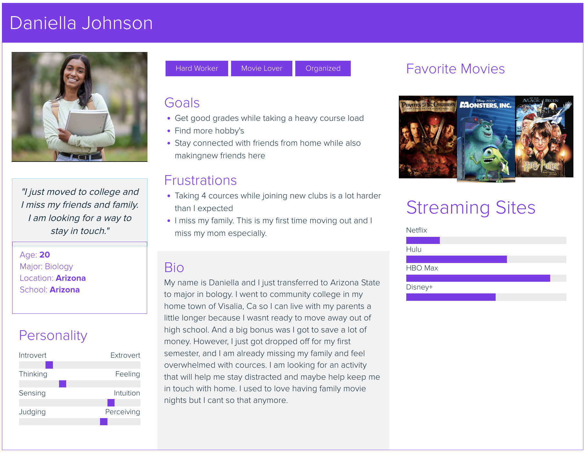
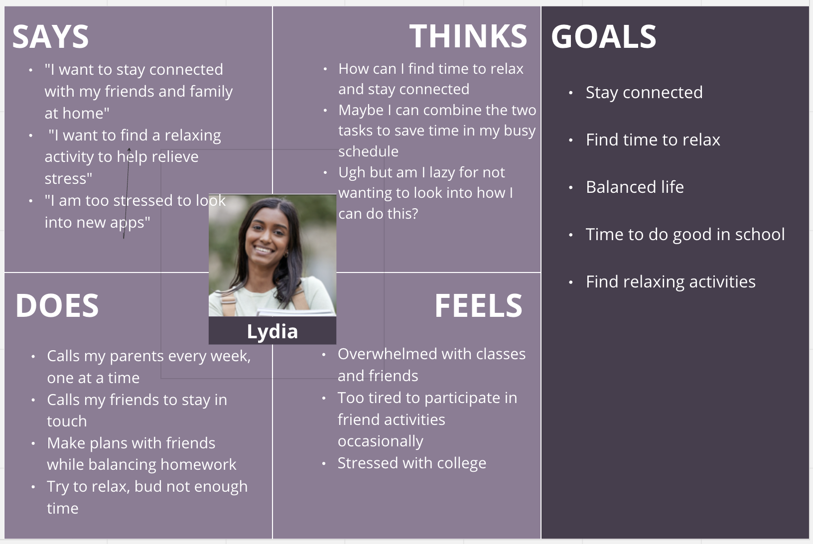
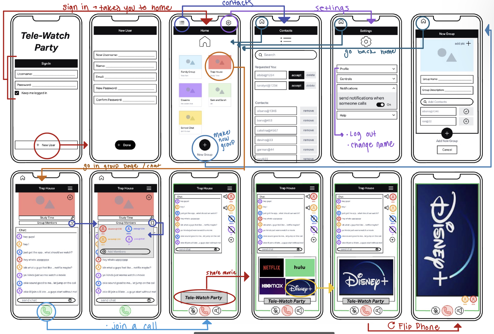
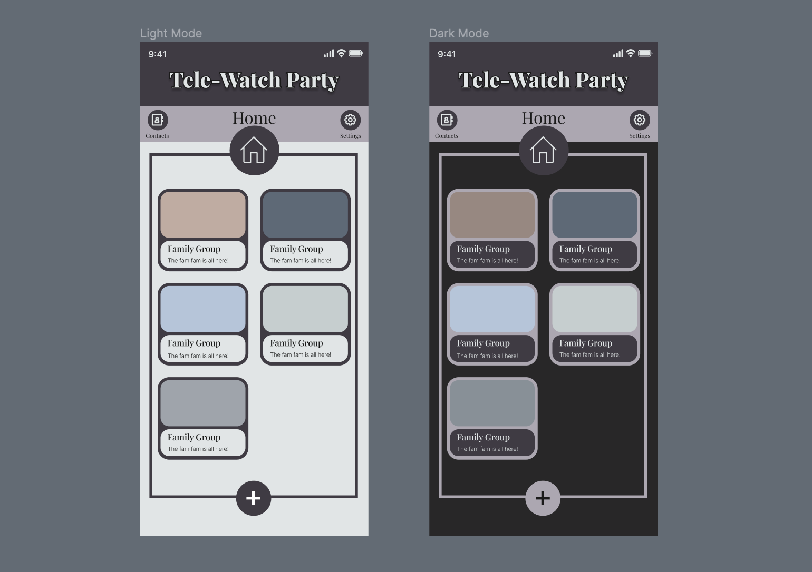
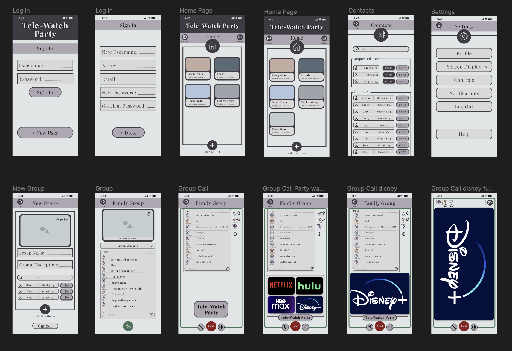

# Tele-Watch Party App
by Sarah Redden

## Introduction 

The Covid-19 pandemic has highlighted the importance of staying connected with loved ones while maintaining social distancing. With people being forced to stay at home, many turned to technology as a means of staying connected. I for one loved to talk with friends and watch shows and movies with them to fill up all the free time I had. However, the sudden surge in demand has led to a number of hastily put-together solutions that are often unreliable and lack user-friendliness.

To address this issue, the focus of this project is on developing an app that is specifically designed to facilitate seamless communication between friends and family members who are not physically together. The app will leverage the best aspects of existing communication platforms and incorporate new features to enhance the overall user experience.

To achieve this, the design process will involve a thorough analysis of user needs and behaviors, as well as an assessment of existing communication tools. The resulting app will be intuitive and user-friendly, with a clean and simple interface that facilitates easy navigation and use. Additionally, security and privacy will be key considerations in the development process, ensuring that users can communicate with confidence and without fear of their data being compromised.

The ultimate goal of this project is to create an app that serves as a one-stop-shop for friends and family to connect and share media, providing a reliable and easy-to-use solution for those seeking to stay connected in a digital world.

## Design Statement 

The purpose of this project is to design and develop an intuitive and user-friendly app, called Tele-Watch Party, that enables seamless communication and media sharing among friends and family members who are physically apart. The app will address the limitations found in existing competitor apps by providing a simplified user experience, allowing users to create groups, engage in messaging, initiate group calls, and easily share movies and shows from popular streaming services.

The design process will involve thorough user research and testing to ensure simplicity and ease of use. The app will feature a clean and intuitive interface, enabling users to navigate effortlessly and access key functionalities. Emphasis will be placed on integrating the app's messaging page and call features, allowing users to engage in real-time conversations while watching media together.

To address the challenges identified during user research, the app will overcome complexities found in certain competitor apps by providing a streamlined user experience. Additionally, the app will circumvent blocking features implemented by streaming services, ensuring users can share their screens and watch shows simultaneously.

Incorporating user feedback and iterative testing will be crucial throughout the development process to refine the app's features and enhance its overall usability. The design will prioritize simplicity, group creation, messaging capabilities, group calling, and seamless media sharing, making Tele-Watch Party a comprehensive and user-centric solution for staying connected in a digital world.

By leveraging the insights gained from user research and addressing the shortcomings of existing apps, Tele-Watch Party aims to be the go-to app for friends and family seeking to connect, chat, and enjoy shared media experiences, ultimately fostering strong bonds and maintaining social connections irrespective of physical distance.

## Competitor Analysis

Cmpeting apps such as Kast and Discord, allow people to stream content from various sources, including YouTube and Amazon Prime Video, and interact with their friends in real-time through a chat function. These apps have provided a new way for people to bond over shared interests and engage in virtual movie nights with loved ones, even when separated by distance. These apps are great ideas, but have some limitations in terms of conection.

The rise of online streaming apps and platforms during the COVID-19 pandemic has not only revolutionized the way people consume entertainment, but also provided a means of staying connected with family and friends. These apps have become a popular way for people to share experiences, enjoy movie nights together, and feel closer despite being physically apart.

I conducted some research on these existing apps using Jakob Nielson's 10 Usability Heuristics which can be found in the link below:
[Click Here](https://sarahsr6.github.io/DH110/Assignments/assign_1/)

I also cinducted some live usability testing to see what users are looking for in these apps and what is currently wrong with them:
[Click Here](https://sarahsr6.github.io/DH110/Assignments/assign_2/)

## User Research
In order to conduct some research on how people typically share media and chat with friends, I decided to use conduct a contextual inquiry with my participants. I conducted an interview with 2 participants and saw what apps they prefer to use given certain scenarios. The link to this research can be found here: 
[Click Here](https://sarahsr6.github.io/DH110/Assignments/assign_3/)

The contextual inquiry conducted revealed unexpected insights into users' preferences and behaviors regarding social media and media sharing apps. Participants showed a preference for familiar apps rather than learning new ones, emphasizing the importance of user-friendliness and easy adoption for app developers. Users tend to avoid tasks they perceive as difficult or confusing, highlighting the need for intuitive designs, especially for less tech-savvy individuals. The dislike of Discord, despite its popularity for media sharing, suggests the need for diverse app options that cater to different user needs and preferences. Overall, the research provided valuable insights that can inform future app development and design decisions, emphasizing the importance of understanding user behavior and attitudes.

## UX Storytelling 
User Experience (UX) storytelling is a technique used in designing and creating digital products and services that aim to engage users by appealing to their emotions, needs, and desires. It is the art of crafting a narrative that connects users with a product or service, and it is a crucial part of UX design. The purpose of UX storytelling is to create a user-centered design approach that prioritizes empathy and understanding of the user's needs, preferences, and behaviors. This approach allows designers to create more engaging and meaningful experiences that connect with users on a deeper level, which ultimately leads to higher user satisfaction, loyalty, and retention. In this way, UX storytelling is an essential tool for designers seeking to create digital products and services that are both functional and emotionally impactful.

I created some personas and empathy maps of the demographics that would be usong my app. For example:

Persona             |  Empathy Map
:-------------------------:|:-------------------------:
  |  

These personas help show what users may be in need for my tele watch app. The full story can be seen here. [Click Here](https://sarahsr6.github.io/DH110/Assignments/assign_4/)

## Wireframe Sketch / Low Fidelity Prototype
I first came up with a low fidelity prototype because it is an important step in the app development process. It allowed me to quickly test and validate my ideas before investing too much time or money in the development process. By creating a low fidelity prototype, I was able to get user feedback early on and make changes as needed, without wasting resources.

The wireflow process was utilized to create a low fidelity prototype of an app or website, which included basic sketches or wireframes of the user interface and a flowchart for navigation. This early-stage prototype allowed for quick testing and validation of ideas, helping to identify potential problems and make necessary changes before investing significant time and resources. Through user testing, several issues were identified, such as unclear buttons, difficulties in finding certain features, and confusion with pull-down menus and the settings tab. These insights will be considered in the next round of development to improve the design. Overall, the wireflow process proved to be a valuable tool for app development, providing a clear vision of the user interface and gathering user feedback before advancing to more advanced stages.

For more detail on how this was made and feedback it provided, click here: [Click Here](https://sarahsr6.github.io/DH110/Assignments/assign_5/)

## Graphic Design Element Variation 
Interface and graphic design is important because it is a main factor contributing to user-friendlyness. The goal is to turn our low fidelity designs into a digitized design with a more developed style. This is achieved through color palletes, shape variations, and typographic variations. The dimentions of the frame for the app was done so using an iphone 14 screen size in an online design program called Figma. Figma is what i used to create more detailed wireframes, but for now I will get into some design choices I've had to make before continuing. Figma allowed me to easily keep all the design choices availible for me to make more frames in the future.

I created a light and dark mode after extensive research with collor pallete and spacing. The final product is below:

For more details on how i came to choose these design choices check here: [Click Here](https://github.com/sarahsr6/DH110/tree/main/Assignments/assign_6)

## High-fidelity prototype (functional/interactive prototype, assignment08)
In order to get to this stage, I started with an idea, created a low fidelity prototype, conducted multiple rounds of testing, then finally created the high fidelity prototype in figma. After designing the colors and layouts of each screen, figma allowed me to also make the prototype interactive with some buttons that will allow me to test outthe flow later.

In this phase of testing, I have made three tasks on my app interactive. I tested the flow of my app and usability with these tasks. First I tested if users can figure out how to create a new group. Then I tested to see if thay can easily figure out how to share a streaming site with friends. Finally checked if they were able to end the call and log out. Since my app is interactive now, it will be like we are testing the real app while still being able to make changes in design if things still need to be changed.

The interactive protoype can be seen here: [here](https://www.figma.com/proto/JoG48N0CxSEeutdR6lSq0O/High-Fidelity-Prototype?type=design&node-id=4-101&scaling=scale-down&page-id=0%3A1)

[

<iframe style="border: 1px solid rgba(0, 0, 0, 0.1);" width="800" height="450" src="https://www.figma.com/embed?embed_host=share&url=https%3A%2F%2Fwww.figma.com%2Fproto%2FJoG48N0CxSEeutdR6lSq0O%2FHigh-Fidelity-Prototype%3Ftype%3Ddesign%26node-id%3D4-101%26scaling%3Dscale-down%26page-id%3D0%253A1" allowfullscreen></iframe>

## Optional evaluation and revision history 
Including cognitive walkthrough; impression test, accessibility audit, usability testing), per each summary and link to the notes (when you share the video or other detailed evidences, I will notify you when you can make the contents private as soon as your work is graded)

## Pitch video 

## Conclusion: what did you learn throughout the process?

